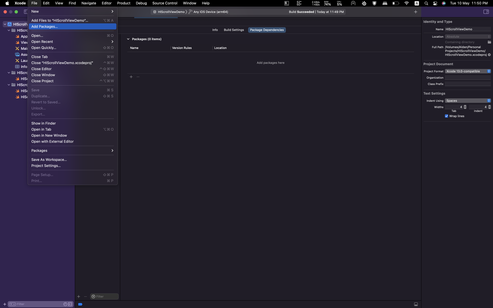
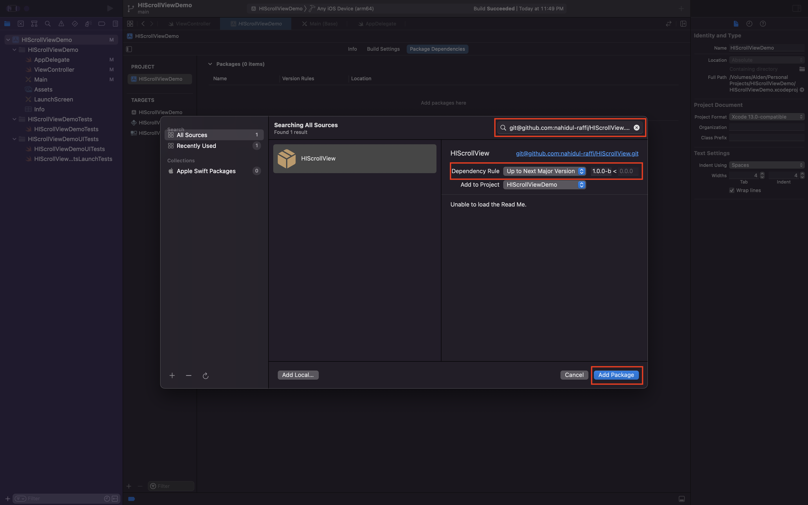
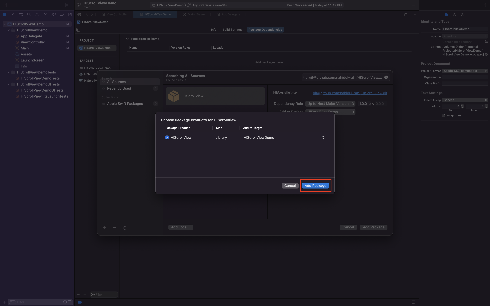

## Introduction
HIScrollView(all versions) supports installation via [Swift Package Manager](https://www.swift.org/package-manager/).

## Requirements

- Requires Xcode 12 or above
- See [Package.swift](Package.swift) for supported platforms and versions.

## Installation
See the subsections below for details about the different installation methods. The methods are mainly based on usecases.

1. [To Projects](#to-projects)
2. [To Packages](#to-packages)

### To Projects

1. Add a package by selecting `File` → `Add Packages…` in Xcode’s menu bar.



---

2. Search HIScrollView package using the repo's URL:

   - HTTPS
   ```console
   https://github.com/nahidul-raffi/HIScrollView.git
   ```
   - SSH
   ```console
   git@github.com:nahidul-raffi/HIScrollView.git
   ```

Next, set the **Dependency Rule** to be `Up to Next Major Version` and specify `1.0.0-beta.1` as the lower bound.

Then, select **Add Package**.



---

3. Select **Add Package**.



---

### To Packages

Integrate via `Package.swift` manifest by adding to the `dependencies` array of your package:

```swift
dependencies: [
    // Dependencies declare other packages that this package depends on
    // .package(url: /* package url */, from: "1.0.0"),
    
    .package(url: "https://github.com/nahidul-raffi/HIScrollView.git", from: "1.0.0-beta.1")
    //.package(url: "git@github.com:nahidul-raffi/HIScrollView.git", from: "1.0.0-beta.1")
],
```

Then in any target that depends on the HIScrollView, add it to the `dependencies` array of that target:

```swift
.target(
    name: "MyTargetName",
  dependencies: [
    .product(name: "HIScrollView", package: "HIScrollView")
    ]
),
```
